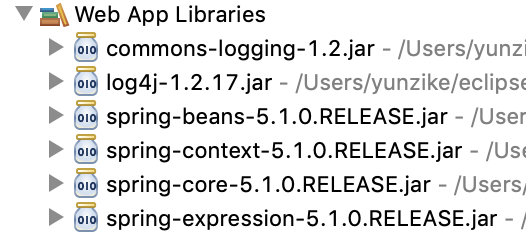

#### Spring概念
1、Spring是开源的轻量级框架  
2、Spring核心主要是两点：  
（1）aop:面向切面编程，扩展功能不通过修改源代码实现；    
（2）ioc：控制反转，比如有一个类，要使用类中的非静态方法，则需要使用new来创建类的对象然后使用对象调用类的方法。而Spring中对象的创建不是通过new方式实现，而是交给Spring配置来创建对象。  
3、Spring是一站式框架
（1）Spring在JavaEE的三层结构中，每一层都提供不同的解决技术。
- Web层：SpringMVC
- service层：Spring的ioc
- dao层：Spring的jdbctemplate  

4、Spring的版本
（1）Hibernate5.x
（2）Spring4.x


#### IOC底层原理实现


#### IOC使用
##### 1、导入jar包   
（1）做Spring最基本的功能时，只需要导入四个核心的Jar包  
（2）导入日志支持Jar包 

##### 2、创建类，在类中创建方法  
````

````
##### 3、创建Spring的配置文件，配置创建类  
（1）Spring核心配置文件名称和位置不是固定的
建议放到Src下面，官方建议文件名为applicationContext.xml  
（2）引入schrma约束

##### 4、写代码测试对象的创建  
